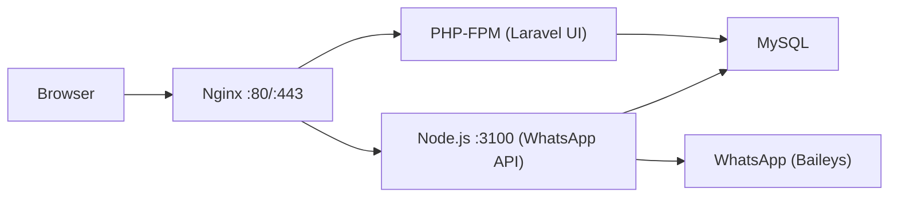

# MPWA v11.5.6 — Proxmox Ubuntu Container Deployment Guide

Complete guide to deploy MPWA WhatsApp Gateway on a Proxmox Ubuntu LXC container with Nginx, SSL, and the built-in install wizard.

---

## Architecture Overview



| Component | Role | Port |
|-----------|------|------|
| **Nginx** | Reverse proxy, SSL, serves Laravel | 80 / 443 |
| **PHP 8.2 + Laravel 12** | Admin panel, install wizard, UI | via PHP-FPM |
| **Node.js + Express** | WhatsApp API, Socket.IO | 3100 (internal) |
| **MySQL** | Database | 3306 (internal) |

---

## Prerequisites

| Item | Required |
|------|----------|
| Proxmox Ubuntu 22.04/24.04 LXC | ✅ |
| RAM | 2 GB minimum |
| CPU | 1-2 cores |
| Disk | 10 GB+ |
| Domain (optional) | For SSL / public access |
| Ports 80, 443 open | For web access |

---

## Part 1 — Create Proxmox LXC Container

From your **Proxmox host**:

```bash
# Create Ubuntu 22.04 container (adjust ID/storage as needed)
pct create 200 local:vztmpl/ubuntu-22.04-standard_22.04-1_amd64.tar.zst \
  --hostname mpwa --memory 2048 --cores 2 --rootfs local-lvm:10 \
  --net0 name=eth0,bridge=vmbr0,ip=dhcp --unprivileged 1

# Start and enter
pct start 200
pct enter 200
```

Or use the Proxmox Web UI to create a container.

---

## Part 2 — Install System Dependencies

### Step 1: System Update

```bash
apt update && apt upgrade -y
apt install -y curl wget git unzip software-properties-common
```

### Step 2: Install Node.js 22 LTS

```bash
curl -fsSL https://deb.nodesource.com/setup_22.x | bash -
apt install -y nodejs
```

Verify:
```bash
node -v   # v22.x.x
npm -v
```

### Step 3: Install PM2 (Process Manager)

```bash
npm install -g pm2
```

### Step 4: Install PHP 8.2 + Extensions

```bash
add-apt-repository ppa:ondrej/php -y
apt update
apt install -y php8.2 php8.2-fpm php8.2-cli php8.2-mysql php8.2-mbstring \
  php8.2-xml php8.2-bcmath php8.2-curl php8.2-zip php8.2-intl php8.2-gd \
  php8.2-tokenizer
```

Verify:
```bash
php -v         # PHP 8.2.x
php -m | grep intl   # should print "intl"
```

### Step 5: Install Composer

```bash
curl -sS https://getcomposer.org/installer | php
mv composer.phar /usr/local/bin/composer
composer --version
```

### Step 6: Install MySQL Server

```bash
apt install -y mysql-server
systemctl enable mysql
systemctl start mysql
```

Create the database:
```bash
mysql
```

```sql
CREATE DATABASE mpwa CHARACTER SET utf8mb4 COLLATE utf8mb4_unicode_ci;
CREATE USER 'mpwa_user'@'localhost' IDENTIFIED BY 'YourStrongPassword123!';
GRANT ALL PRIVILEGES ON mpwa.* TO 'mpwa_user'@'localhost';
FLUSH PRIVILEGES;
EXIT;
```

> [!IMPORTANT]
> Change `YourStrongPassword123!` to your own strong password. Remember these credentials — you'll enter them in the install wizard.

### Step 7: Install Nginx

```bash
apt install -y nginx
systemctl enable nginx
systemctl start nginx
```

---

## Part 3 — Deploy the Application

### Step 8: Upload / Clone the Application

```bash
mkdir -p /var/www/mpwa
cd /var/www/mpwa
```

**Option A — Git clone** (if pushed to a repo):
```bash
git clone https://github.com/anuragkumarsingh134/mpwa-24-4-2026.git .
```

**Option B — Upload via SCP** (from your Windows PC):
```powershell
# Run this from your Windows PC
scp -r "C:\Users\TINY11\Desktop\ANTIGRAVITY\PRO WAGATEWAY 5\mpwa-magd-v11.5.6\*" root@<CONTAINER-IP>:/var/www/mpwa/
```

### Step 9: Install Node.js Dependencies

```bash
cd /var/www/mpwa
npm install
```

### Step 10: Apply Baileys Patch

The patch files are included in the repo root. Copy them into node_modules:

```bash
cd /var/www/mpwa
cp validate-connection.js  node_modules/@onexgen/baileys/lib/Utils/validate-connection.js
cp validate-connection.d.ts node_modules/@onexgen/baileys/lib/Utils/validate-connection.d.ts
```

> [!CAUTION]
> This patch is **required** for WhatsApp connectivity. Don't skip it. Re-apply after every `npm install`.

### Step 11: Install PHP / Laravel Dependencies

```bash
cd /var/www/mpwa
composer install --no-dev --optimize-autoloader
```

### Step 12: Set File Permissions

```bash
chown -R www-data:www-data /var/www/mpwa
chmod -R 775 /var/www/mpwa/storage /var/www/mpwa/bootstrap/cache
```

> [!NOTE]
> **Do NOT** run `php artisan migrate` or `php artisan key:generate` manually. The install wizard handles all of this automatically (migrations, seeding, admin creation, `.env` configuration). Just make sure `APP_INSTALLED=false` is set in the `.env` file.

---

## Part 4 — Configure Nginx Reverse Proxy

### Step 13: Create Nginx Config

```bash
nano /etc/nginx/sites-available/mpwa
```

Paste the following — replace `wa.yourdomain.com` with your domain (or use `_` for any/IP access):

```nginx
server {
    listen 80;
    server_name wa.yourdomain.com;

    root /var/www/mpwa/public;
    index index.php index.html;

    client_max_body_size 50M;

    # Laravel PHP routes
    location / {
        try_files $uri $uri/ /index.php?$query_string;
    }

    # PHP-FPM
    location ~ \.php$ {
        fastcgi_pass unix:/var/run/php/php8.2-fpm.sock;
        fastcgi_param SCRIPT_FILENAME $realpath_root$fastcgi_script_name;
        include fastcgi_params;
    }

    # Node.js API proxy
    location /api/ {
        proxy_pass http://127.0.0.1:3100;
        proxy_http_version 1.1;
        proxy_set_header Upgrade $http_upgrade;
        proxy_set_header Connection "upgrade";
        proxy_set_header Host $host;
        proxy_set_header X-Real-IP $remote_addr;
        proxy_set_header X-Forwarded-For $proxy_add_x_forwarded_for;
        proxy_set_header X-Forwarded-Proto $scheme;
        proxy_read_timeout 86400;
    }

    # Socket.IO proxy
    location /socket.io/ {
        proxy_pass http://127.0.0.1:3100;
        proxy_http_version 1.1;
        proxy_set_header Upgrade $http_upgrade;
        proxy_set_header Connection "upgrade";
        proxy_set_header Host $host;
        proxy_set_header X-Real-IP $remote_addr;
        proxy_set_header X-Forwarded-For $proxy_add_x_forwarded_for;
        proxy_set_header X-Forwarded-Proto $scheme;
        proxy_read_timeout 86400;
    }

    # Block .env and hidden files
    location ~ /\.(?!well-known) {
        deny all;
    }
}
```

Enable and test:

```bash
ln -s /etc/nginx/sites-available/mpwa /etc/nginx/sites-enabled/
rm -f /etc/nginx/sites-enabled/default
nginx -t          # must say "syntax is ok"
systemctl reload nginx
```

---

## Part 5 — Start the Application

### Step 14: Start Node.js Server with PM2

```bash
cd /var/www/mpwa
pm2 start server.js --name mpwa-node
pm2 save
pm2 startup
# Run the command PM2 outputs ↑
```

Verify:
```bash
pm2 status
pm2 logs mpwa-node --lines 10
# Should say: "Server running and listening on port: 3100"
```

### Step 15: Verify All Services

```bash
systemctl status nginx
systemctl status php8.2-fpm
systemctl status mysql
pm2 status
```

---

## Part 6 — Run the Install Wizard 🧙

Open your browser and go to:

```
http://wa.yourdomain.com
```

(or `http://<CONTAINER-IP>` if no domain yet)

The app will **automatically redirect to the install wizard** because `APP_INSTALLED=false`.

### Wizard Steps:

| Step | What to enter |
|------|--------------|
| **1. Requirements** | Verify all checks are ✅ green, click **Next** |
| **2. License** | Pre-filled, click **Next** |
| **3. Database** | Host: `localhost`, Database: `mpwa`, Username: `mpwa_user`, Password: `YourStrongPassword123!` |
| **4. Admin Account** | Your desired admin username, email, and password |
| **5. Server Config** | Server Type: **Other**, Port: `3100`, URL Node: `http://wa.yourdomain.com` |

Click **Install** and the wizard will:
- Test the database connection
- Run `migrate:fresh` + `db:seed` (creates all tables automatically)
- Generate app key and create storage symlink
- Update the `.env` file with all your settings
- Create the admin user
- Set `APP_INSTALLED=true`

After installation, you'll be automatically logged in and redirected to the **dashboard** 🎉

---

## Part 7 — SSL Certificate (Optional but Recommended)

### Step 16: Install Certbot & Get SSL

```bash
apt install -y certbot python3-certbot-nginx
certbot --nginx -d wa.yourdomain.com
```

Certbot will automatically configure HTTPS and redirect HTTP → HTTPS.

Verify auto-renewal:
```bash
certbot renew --dry-run
```

After SSL, update the **Server Config** in the app settings:
- URL Node: `https://wa.yourdomain.com`

---

## Part 8 — Security Hardening

### Firewall

```bash
apt install -y ufw
ufw allow OpenSSH
ufw allow 'Nginx Full'
ufw enable
ufw status
```

> [!TIP]
> The Node.js port (3100) stays internal-only. Nginx proxies all traffic.

### Fail2ban (SSH protection)

```bash
apt install -y fail2ban
systemctl enable fail2ban
systemctl start fail2ban
```

---

## Quick Reference — Common Commands

| Action | Command |
|--------|---------|
| Restart Node app | `pm2 restart mpwa-node` |
| View Node logs | `pm2 logs mpwa-node` |
| Restart Nginx | `systemctl restart nginx` |
| Restart PHP-FPM | `systemctl restart php8.2-fpm` |
| Restart MySQL | `systemctl restart mysql` |
| Clear Laravel cache | `cd /var/www/mpwa && php artisan config:clear && php artisan cache:clear` |
| Check SSL cert | `certbot certificates` |
| Pull updates | `cd /var/www/mpwa && git pull && npm install && composer install --no-dev && php artisan migrate --force && pm2 restart mpwa-node` |

---

## Troubleshooting

| Issue | Fix |
|-------|-----|
| **502 Bad Gateway** | Check PM2: `pm2 status`. If crashed: `pm2 restart mpwa-node` then check `pm2 logs mpwa-node` |
| **Laravel 500 error** | Check `storage/logs/laravel.log`. Fix permissions: `chown -R www-data:www-data /var/www/mpwa/storage` |
| **Install wizard doesn't appear** | Ensure `APP_INSTALLED=false` in `.env` |
| **DB connection fails in wizard** | Verify MySQL is running: `systemctl status mysql`. Check credentials match Step 6 |
| **WhatsApp disconnects** | Ensure Baileys patch applied (Step 10). Check PM2 logs |
| **PHP extension missing** | `apt install php8.2-<extension>` then `systemctl restart php8.2-fpm` |
| **SSL/Certbot fails** | Ensure port 80 open, DNS points to server. Disable Cloudflare proxy temporarily |

---

## Proxmox-Specific Settings

### Auto-start container on boot

```bash
# From Proxmox HOST
pct set 200 --onboot 1
```

### Adjust resources

```bash
# From Proxmox HOST
pct set 200 --memory 2048
pct set 200 --cores 2
```

### Container backup

Use Proxmox Web UI → Select container → Backup → Backup now

---

## PM2 Log Rotation

```bash
pm2 install pm2-logrotate
pm2 set pm2-logrotate:max_size 10M
pm2 set pm2-logrotate:retain 7
```
